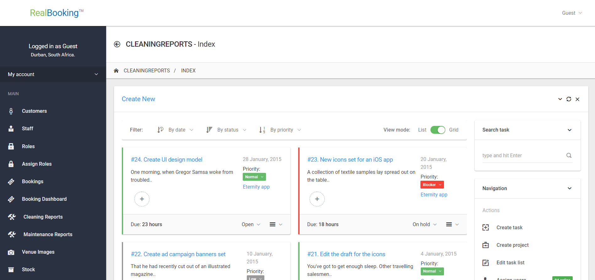
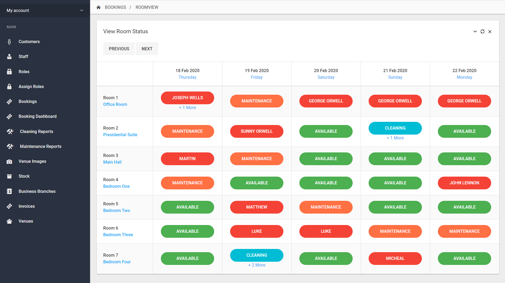
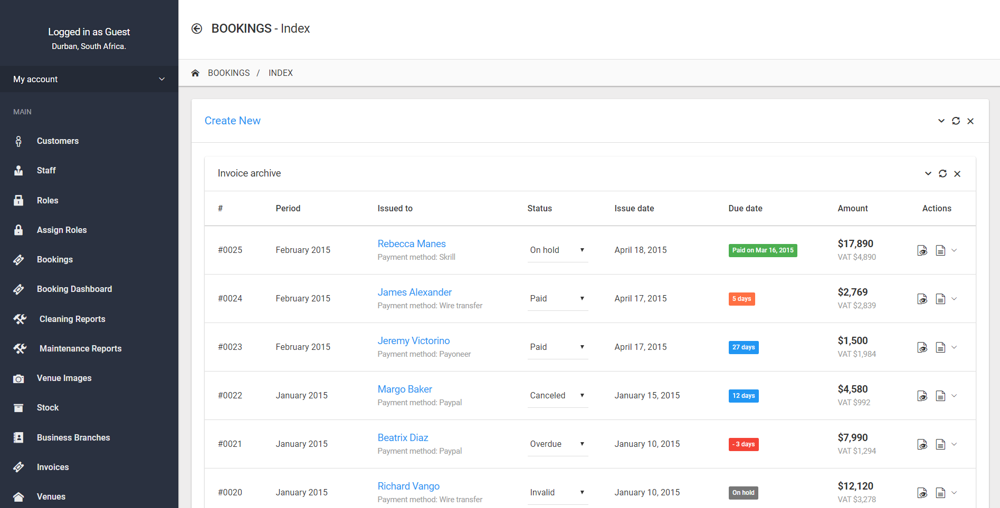
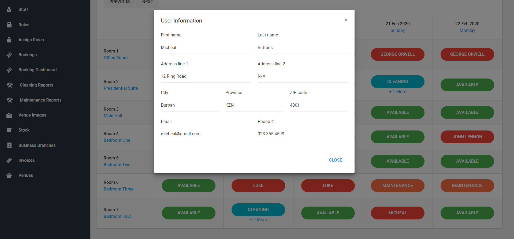

# BookingManager #
### Description:

A hotel / guesthouse booking software package that manages job cards, booking slots etc.

## Screenshots ##

## Running ##

### Steps ###

- [ ] `git clone https://github.com/caybokotze/BookingManager`
- [ ] Run: `nuget restore REM.sln`

### Requirements ###

- [ ] Donet 4.6.1 SDK & Build Tools
